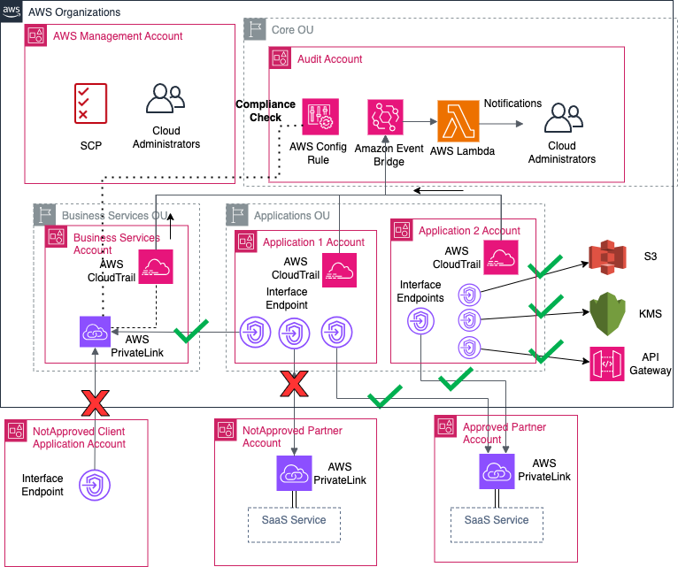

## Governing and securing AWS PrivateLink service access at scale in multi-account environments

This solution provides an approach for centralized governance for PrivateLink based services across your multi-account environment. It provides a way to create preventative controls through the use of service control policies (SCPs) and detective controls through event-driven automation. This allows your application teams to consume internal and external services while adhering to organization policies and provides a mechanism for centralized control as your AWS environment grows.

This is intended for customers who are using AWS PrivateLink to have secure communication to AWS services, their own internal services, and third-party services in the AWS Cloud. As these environments scale, the number of PrivateLink connections outbound to external services and inbound to internal services increase and are spread out across multiple accounts in virtual private clouds (VPCs). While AWS Identity and Access Management (IAM) policies allow you to control access to individual PrivateLink services, customers want centralized governance for the use of PrivateLink in adherence with organizational standards and security needs.

The solution architecture and the components of the solution are described in the blog post [**Governing and securing AWS PrivateLink service access at scale in multi-account environments](https://aws.amazon.com/blogs/security/governing-and-securing-aws-privatelink-service-access-at-scale-in-multi-account-environments/)
The solution architecture shows the architecture components of the solution as awell as the Privatelink connectivity paths covered by the solution.

## Security

See [CONTRIBUTING](CONTRIBUTING.md#security-issue-notifications) for more information.

## License

This library is licensed under the MIT-0 License. See the LICENSE file.

